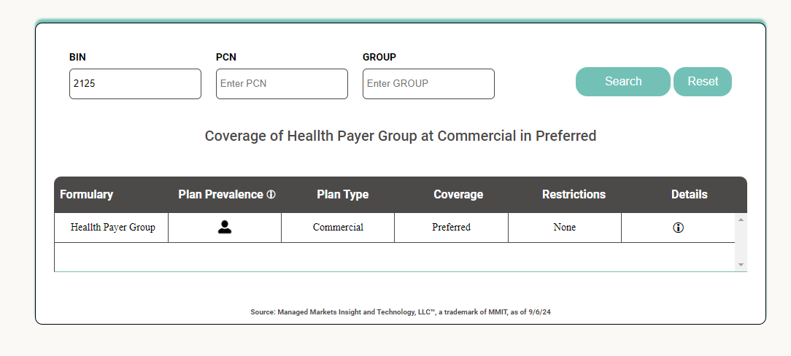
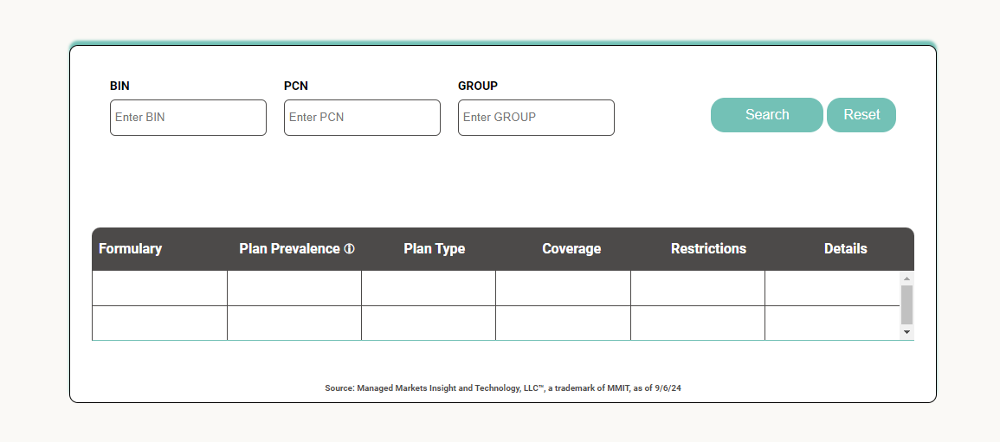
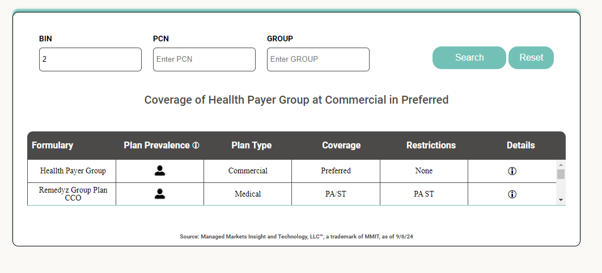
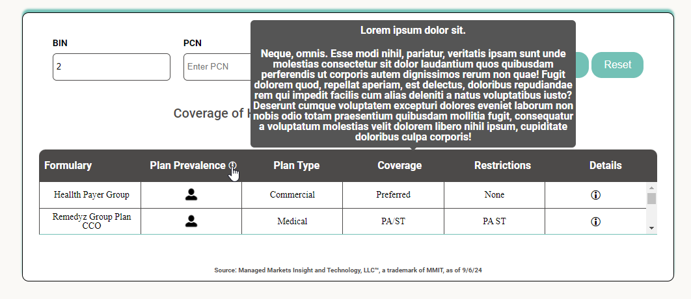
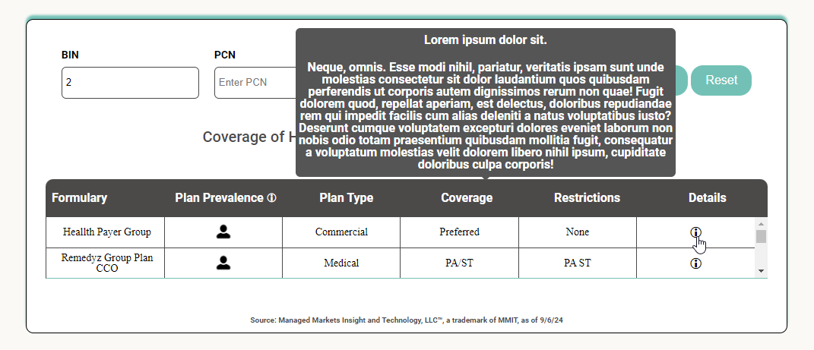

## Table of contents

- [Overview](#overview)
  - [Screenshot](#screenshot)
  - [Live Hosting](#live-hosting)
- [My process](#my-process)
  - [Built with](#built-with)
  - [Highlights](#highlights)
  - [Useful resources](#useful-resources)

## Overview

BIN/PCN/GROUP mapping to MMIT

Using MMIT Analytics data, bridging as a service for BIN/PCN/GRP mapping along with API to display the payer and their coverage requrements directly

(next steps)
combined with mapping to our API and Coverage Finder

### Screenshot







### Live Hosting

Open index.html within browser to run lookup by BIN/PCN/GROUP 

## My process

### Built with

- Semantic HTML5 markup
- CSS custom properties
- Flexbox
- JavaScript

### Highlights

```html
<div class="btn-label-group">
<label>BIN<input onfocus="this.value=''" type="text" id="itemBIN" placeholder="Enter BIN" list="bin-num" name="bin" ></label>
<datalist id="bin-num">
  <option value="2125">
  <option value="2136">
  <option value="2147">
  <option value="2279">
  <option value="2301">
  <option value="2180">
  <option value="1">
  <option value="2">
  <option value="3">
  <option value="0">
</datalist>
</div>
```

```js
  // Bin Search
  function searchItemBIN(items, queryBIN) {
    var nameReturn = items.filter(item => item.bin.toString().toLowerCase().includes(queryBIN));
    return nameReturn;
  }
  // PCN Search
  function searchItemPCN(items, queryPCN) {
    const lowerCaseQuery = queryPCN.toLowerCase();

    var nameReturn = items.filter(item => item.pcn.toString().toLowerCase().includes(lowerCaseQuery));
    return nameReturn;
  }
  // Group Search
  function searchItemGROUP(items, queryGROUP) {
    const lowerCaseQuery = queryGROUP.toLowerCase();
    var nameReturn = items.filter(item => item.group.toLowerCase().includes(lowerCaseQuery));
    return nameReturn;
  }
```

### Useful resources

- [The Markdown Guide](https://www.markdownguide.org/)

- [Reset CSS](https://meyerweb.com/eric/tools/css/reset/) - The goal of a reset stylesheet is to reduce browser inconsistencies in things like default line heights, margins and font sizes of headings, and so on.